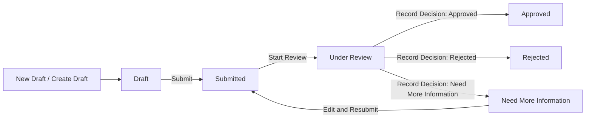

# User Guide

This guide shows how to use the website in two modes:

- As a normal user who creates and submits an application
- As a reviewer who checks submitted applications and makes a decision

The site has a workflow built into it. The frontend exposes these steps and actions:

## Before You Start

Open the website in your browser.

At the top of the page, you will see:

- `Applications` to open the queue
- `New Draft` to create a new application
- A role switch that lets you choose `User` or `Reviewer`
- A `Mock` or `Live` switch for the backend connection

If the backend is unavailable, the site may show an offline mock message. You can still explore the app, but the data may be local to your browser.

## How To Use The Site As A User

### 1. Stay in User mode

Use the role switch in the top-right area and select `User`.

This keeps the site in applicant mode. In this mode, you can create drafts, edit draft applications, and submit them.

### 2. Open the applications queue

Click `Applications` in the top navigation.

You will see a list of applications with columns for tracking number, applicant, company, type, status, and created date.

### 3. Create a new draft

Click `New Draft` in the top navigation or `Create Draft` on the applications page.

Fill in the form:

- Applicant name
- Applicant email
- Company name
- Application type
- Description

Then click `Create Draft`.

### 4. Review the draft details

After you save the draft, the app takes you to the application detail page.

On this page, you can see:

- The tracking number
- Applicant details
- The current workflow status
- The description
- The created, updated, submitted, and reviewed timestamps

### 5. Edit the draft if needed

If the application is still in `Draft`, click `Edit`.

Update the information, then click `Save Draft`.

If you change your mind, click `Cancel` to return without saving.

### 6. Submit the application

When the draft is ready, click `Submit`.

The status changes from `Draft` to `Submitted`.

After that, the application waits for a reviewer to begin the review.

### 7. Respond if the reviewer asks for more information

If the reviewer changes the status to `Need More Information`, the application becomes editable again.

Go back to the application detail page and click `Edit` or `Resubmit`.

Make your changes, then save the form again.

The application returns to the workflow after you resubmit it.

### 8. Stop editing when the decision is final

If the application becomes `Approved` or `Rejected`, it is locked.

You can still view it, but you cannot edit or resubmit it.

## How To Use The Site As A Reviewer

### 1. Switch to Reviewer mode

Use the role switch in the top-right area and select `Reviewer`.

This changes how the site opens application records.

### 2. Open the applications queue

Click `Applications`.

In Reviewer mode, clicking an application opens the reviewer workspace instead of the normal user detail page.

### 3. Find the application you want to review

Look for the application with status `Submitted`.

That status means the applicant has finished the draft and sent it in.

### 4. Start the review

Open the submitted application.

If the application is still in `Submitted`, click `Start Review`.

This moves the application into `Under Review` and opens the reviewer decision form.

### 5. Inspect the application

On the reviewer page, check:

- Applicant name
- Applicant email
- Company name
- Application type
- Description
- Current status timeline

The page also shows the submission and review timestamps, so you can see where the application is in the workflow.

### 6. Choose a decision

Use the decision dropdown to select one of these options:

- `Approved`
- `Need More Information`
- `Rejected`

Then add a reviewer comment if needed.

The form requires a comment for:

- `Need More Information`
- `Rejected`

### 7. Record the decision

Click `Record Decision`.

The application will update immediately:

- `Approved` completes the workflow
- `Rejected` completes the workflow
- `Need More Information` sends the application back so the user can edit and resubmit it

### 8. Return to the queue

After you record the decision, the app takes you back to the application detail page.

From there, you can return to `Applications` and continue with the next record.

## What The Statuses Mean

- `Draft`: The user can still edit the application
- `Submitted`: The application has been sent in and is waiting for review
- `Under Review`: The reviewer is actively reviewing the application
- `Need More Information`: The user must update the application before it can move forward again
- `Approved`: The application is finished
- `Rejected`: The application is finished

## Simple Workflow Summary

### If you are a user

1. Open `New Draft`
2. Fill in the form
3. Save the draft
4. Open the application from `Applications`
5. Edit it if needed
6. Click `Submit`
7. If the reviewer asks for more information, edit and resubmit it

### If you are a reviewer

1. Switch to `Reviewer`
2. Open `Applications`
3. Open the submitted application
4. Click `Start Review` if needed
5. Review the details
6. Choose a decision
7. Add a comment when required
8. Click `Record Decision`

## Tips

- Use `User` mode when you are filling out or editing an application
- Use `Reviewer` mode when you are making a decision
- If you do not see the data you expect, check whether the site is using the live backend or the offline mock mode
- If a page says the record was not found, return to `Applications` and open it again from the queue
